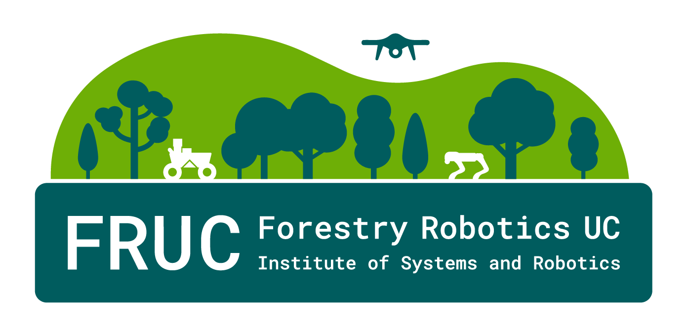

#      FRUC ROS Utils

`Fruc ROS Utils` is a ROS bag and dataset tooling repo.

It is built around a few practical workflows:
- inspect ROS 2 bags (`.mcap`, `.db3`)
- convert ROS 2 bags to ROS 1 `.bag`
- clean, filter, and rewrite ROS 1 bags
- export metadata, navsat, and calibration-related artifacts
- run these tools in Docker when you do not want to manage ROS environments locally

This repo is not a single monolithic app. It is a toolbox. The fastest way to use it is to pick the right entrypoint for the job:

| Tool | Use it for |
| --- | --- |
| `ros2utils` | ROS 2 bag inspection and ROS 2 -> ROS 1 conversion |
| `ros1utils` | ROS 1 bag processing, navsat utilities, metadata export |
| `bagutils` | Dispatcher entrypoint that forwards to `ros1utils` or `ros2utils` |
| `scripts/` | One-off helpers and batch scripts |
| `Docker/ros` | Dockerized ROS 1 / ROS 2 utility environment |
| `Docker/iKalibr` | iKalibr runtime, not the `ros2utils` compose stack |


## Install Modes

This repo supports two normal ways of exposing the CLI tools:

- `pip install .` or the Docker images: installs the Python package from `pyproject.toml` and exposes `bagutils`, `ros1utils`, and `ros2utils` as console scripts.
- catkin workspace usage: `catkin_python_setup()` installs the same Python packages, and `CMakeLists.txt` installs matching wrapper scripts for `bagutils`, `ros1utils`, `ros2utils`, and `mapir_ndvi_node.py`.

That means the intended command names are the same in both environments:

```bash
bagutils --help
ros1utils --help
ros2utils --help
```

The standalone helpers in `scripts/` are compatibility wrappers around packaged modules. They are meant for direct repo usage and bootstrap `src/` automatically when needed.
For ROS 2 -> ROS 1 conversion, prefer `ros2utils convert_to_ros1` as the primary path.

## Start Here

If you only need the common bag workflows, start with Docker:

```bash
cd /home/forestsphere/work_utils/fruc_ros_utils/Docker/ros
BAGS_PATH=/path/to/bags_root docker compose build noetic jazzy
```

Then:

```bash
BAGS_PATH=/path/to/bags_root docker compose run --rm jazzy ros2utils --help
BAGS_PATH=/path/to/bags_root docker compose run --rm noetic ros1utils --help
```

Important:
- run `docker compose ...` from the host shell
- use the compose file in `Docker/ros` for `jazzy` and `noetic`
- inside containers, your bag root is mounted at `/bags`

## Common Tasks

For Jazzy -> Noetic bag conversion, the default workflow in this repo is offline:
- inspect the ROS 2 bag first
- convert offline with `rosbags` through `ros2utils convert_to_ros1`
- only reach for a live `ros1_bridge` replay if offline conversion cannot handle a custom type

Inspect a ROS 2 bag:

```bash
BAGS_PATH=/path/to/bags_root docker compose -f Docker/ros/docker-compose.yml run --rm jazzy \
  ros2utils info --bag /bags/session/run_01.mcap
```

Convert ROS 2 to ROS 1 with chunking:

```bash
BAGS_PATH=/path/to/bags_root docker compose -f Docker/ros/docker-compose.yml run --rm jazzy \
  ros2utils convert_to_ros1 \
    --bag /bags/session/run_01.mcap \
    --out /bags/session/run_01_ros1/ \
    --split-duration 10m
```

Convert one or more ROS 2 bags with the standalone duration wrapper:

```bash
python3 scripts/convert_bags_per_duration.py \
  --input-folder /path/to/ros2_bags \
  --output-folder /path/to/ros1_bags \
  --duration 300
```

That script is a thin compatibility layer over `ros2utils convert_to_ros1 --split-duration`, so there is only one split-and-convert implementation to maintain.

Summarize a ROS 1 bag:

```bash
BAGS_PATH=/path/to/bags_root docker compose -f Docker/ros/docker-compose.yml run --rm noetic \
  ros1utils calculate_bag_duration --in /bags/session/run_01_ros1.bag --total
```

Run the offline MAPIR NDVI helper:

```bash
BAGS_PATH=/path/to/bags_root docker compose -f Docker/ros/docker-compose.yml run --rm noetic \
  ros1utils mapir_ndvi \
    --in /bags/input.bag \
    --out /bags/output_ndvi.bag \
    --image-topic /mapir/image_raw \
    --output-topic /mapir/indices/ndvi \
    --publish-color \
    --color-topic /mapir/indices_color/ndvi \
    --colormap plant_health
```

## Documentation

- [docs/README.md](docs/README.md): documentation index
- [docs/DOCKER.md](docs/DOCKER.md): Docker usage, compose files, host vs container paths
- [docs/IKALIBR_DOCKER.md](docs/IKALIBR_DOCKER.md): iKalibr setup and troubleshooting
- [docs/COMMANDS.md](docs/COMMANDS.md): command reference with examples
- [UTILS.md](docs/UTILS.md): shared utilities overview


## Repository Layout

```text
fruc_ros_utils/
|- config/              YAML defaults and user overrides
|- Docker/              compose stacks for ROS tools and iKalibr
|- docs/                documentation index and references
|- pyproject.toml       Python package metadata used by Docker and pip installs
|- scripts/             helper scripts and batch wrappers
|- setup.py             catkin-compatible Python package metadata
|- src/fruc_ros_utils/bag/     ros1utils, ros2utils, bagutils, bag-processing helpers
|- src/fruc_ros_utils/system/  system monitoring and publishers
|- src/fruc_ros_utils/utils/   shared helpers
|- src/fruc_ros_utils/vision/  image and illumination utilities
```

## Config Files

- `config/dev_defaults.yaml`: repo defaults
- `config/user_config.yaml`: local overrides

## License

MIT
